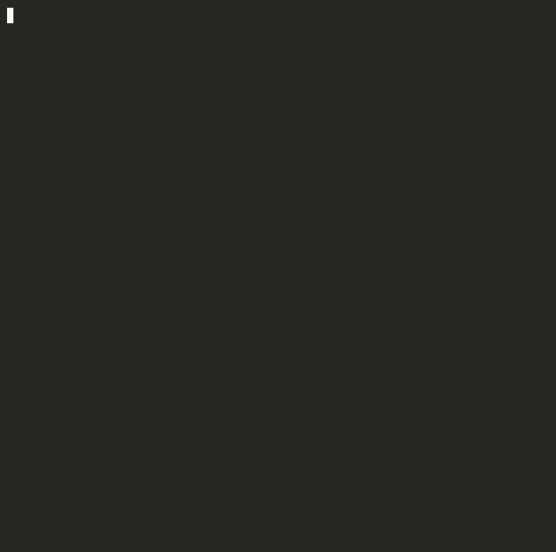

<div align="center">

<table>
  <tr>
    <td></td>
    <td></td>
  </tr>
</table>

<p><sub>Gopher created with <a href="https://gopherize.me">gopherize.me</a> · Artwork by <a href="https://twitter.com/ashleymcnamara">Ashley McNamara</a>, inspired by <a href="http://reneefrench.blogspot.com/">Renee French</a></sub></p>

### ⚡ The Ultimate Fast, Visual & Intelligent Access Log Analyzer for Caddy v2 ⚡

[](https://go.dev)
[](https://pkg.go.dev/github.com/L9Lenny/caddy-analyzer)
[](https://l9lenny.github.io/caddy-analyzer/)
[](https://github.com/L9Lenny/caddy-analyzer/actions)
[](LICENSE)
[](https://github.com/L9Lenny/caddy-analyzer)

---

**`caddy-analyzer`** is a ultra-fast, zero-config CLI tool, interactive TUI dashboard, threat detector, and offline HTML report generator designed natively for **Caddy v2 structured JSON access logs**.

📖 **Official Documentation**: [https://l9lenny.github.io/caddy-analyzer/](https://l9lenny.github.io/caddy-analyzer/)

</div>

## 🎥 Demo



---

## ✨ Features

- ⚡ **Native Caddy v2 JSON Parsing**: Understands Caddy's structured log schema out-of-the-box (no regex configs required).
- 📊 **Visual Terminal Bar Charts**: Displays Unicode proportion bars (`████████░░`) and Lipgloss status badges directly in your terminal.
- 🛡️ **Built-in Threat & Anomaly Detector (`--detect`)**: Identifies SQL Injection, XSS, Path Traversal / LFI, Log4j, RCE, sensitive file probes (`.env`, `.git/config`), and scanner tools. Shows per-IP suspicious request details.
- 🚫 **Real-time Firewall Guard (`guard`)**: Automatically blocks malicious IPs in real time via `iptables` thresholds.
- 🤖 **Traffic Classifier**: Differentiates human users from search engine crawlers (Googlebot, Bingbot, Yandex, DuckDuckBot) and automated scrapers.
- 🔍 **Comparative Diff Engine (`diff`)**: Compare two log files side-by-side (e.g. before vs after deployment) to detect 5xx error spikes, RPS shifts, and latency regressions.
- 🌐 **Interactive Single-File HTML Dashboard (`-f html`)**: Generates standalone, dark-mode visual web reports for sharing with team members.
- 📺 **6-Tab Interactive TUI Dashboard (`--watch`)**: Live Bubbletea/Lipgloss dashboard featuring real-time log streaming (colorized like `tail`), security alerts, and top metrics.
- 🐳 **Multi-Source Support**: Read from files (`access.log`), stdin (`-`), Docker (`docker://caddy`), Kubernetes (`k8s://pod`), and systemd (`journalctl://caddy`).
- 🎨 **Smart Filter Listing**: When using entry-level filters (`--ip`, `--5xx`, etc.), displays a color-coded log listing instead of an aggregate report — making filtered output immediately actionable.
- 🔍 **Per-IP & CIDR Filtering**: Filter by single IP or CIDR subnet (`--ip 10.0.0.0/8`) — works with both `caddy-analyze` and `caddy-analyze tail`.
- 📋 **Active Filter Display**: All active filters are shown in the report header (table, JSON, CSV, HTML) so you always know what filtering is applied.

---

## 📦 Installation

### Linux & macOS (One-Line Installer)

```bash
curl -sSfL https://raw.githubusercontent.com/L9Lenny/caddy-analyzer/main/install.sh | sh
```

### Windows (PowerShell Installer)

```powershell
iwr -useb https://raw.githubusercontent.com/L9Lenny/caddy-analyzer/main/install.ps1 | iex
```

### Via Go Toolchain

```bash
go install github.com/L9Lenny/caddy-analyzer/cmd/caddy-analyze@latest
```

### Via Docker

```bash
docker run --rm -v /var/log/caddy:/logs ghcr.io/L9Lenny/caddy-analyzer /logs/access.log
```

---

## ⚡ Quick Start & Auto-Configuration

Set your default log source once so you don't have to specify log file paths on every run:

```bash
# Set default log source once (local or --global)
caddy-analyze config /var/log/caddy/access.log

# All commands read from your configured default log source automatically:
caddy-analyze
caddy-analyze --detect
caddy-analyze top ip
caddy-analyze --slow 500ms --no-bots

# Stream colorized logs in real time
caddy-analyze tail docker://my-caddy

# Filter by IP — shows color-coded log listing (not aggregate report)
caddy-analyze --ip 192.168.1.100 /var/log/caddy/access.log
caddy-analyze --ip 10.0.0.0/8 /var/log/caddy/access.log

# Filter by CIDR + status class, exclude bots
caddy-analyze --ip 10.0.0.0/8 --5xx --no-bots /var/log/caddy/access.log

# Generate standalone dark-mode HTML report
caddy-analyze -f html -o report.html --detect

# Tail with filters (real-time streaming)
caddy-analyze tail --ip 10.0.0.0/8 --no-bots docker://my-caddy
```

---

## 🎨 Filter Behavior: Listing vs Report

When you apply entry-level filters (`--ip`, `-s`, `-m`, `-p`, `--slow`, `--5xx`, `--no-bots`, `-g`, etc.), `caddy-analyze` automatically switches to a **color-coded log listing** instead of the aggregate statistical report. This makes filtered output immediately actionable — you see exactly which requests matched.

```
caddy-analyze --ip 10.0.0.0/8 access.log
15 entries matched

14:29:01  204 OK  OPTIONS /heartbeat  (0 B, 1.05ms) - 104.28.161.103 [Windows/Edge]
14:29:01  200 OK  POST /heartbeat     (0 B, 4.04ms) - 104.28.161.103 [Windows/Edge]
14:29:02  204 OK  OPTIONS /heartbeat  (0 B, 1.15ms) - 104.28.164.102 [Windows/Edge]
```

To force the aggregate report even with filters, use `-f json`, `-f csv`, `-f html`, or `-o <file>`.

Time-based filters (`--from`, `--to`) alone still show the aggregate report.

### Active Filter Display

All active filters are shown in the report header across all output formats:

- **Table**: `Filters: --ip 10.0.0.0/8 --5xx` right below the title
- **JSON**: `"filters": ["--ip 10.0.0.0/8", "--5xx"]` field
- **CSV**: `filter,--ip 10.0.0.0/8` rows
- **HTML**: Color-coded tags below the header

---

## 🖥️ TUI Dashboard Colors (`--watch`)

The live real-time stream (tab 2) in the interactive dashboard now uses the same color scheme as `caddy-analyze tail`:
- **2xx** → green, **3xx** → cyan, **4xx** → yellow, **5xx** → red
- **IP** → purple, **Path** → white, **Timestamp** → dim gray
- **Bot** → orange with name

---

## 📖 Command Reference

```
caddy-analyze [flags] [source...]

Subcommands:
  tail [source...]                      Stream and colorize Caddy access logs in real time
  top [dimension] [source...]           Quick top-N metric inspector (path, ip, ua, status, bandwidth)
  diff <baseline_log> <target_log>      Compare two log files for RPS shifts, 5xx spikes, and latency changes
  guard [source...]                     Auto-block malicious IPs in real time via iptables
  config [show|set|reset|source]        Manage persistent default log source configuration
  block <ip...>                         Manually block IP address via iptables
  unban <ip...>                         Remove IP address block from iptables
```

### 🚩 Flags Reference

| Flag | Short | Default | Description |
| :--- | :---: | :---: | :--- |
| `--detect` | `-d` | `false` | Enable security threat detection (SQLi, XSS, Path Traversal, Log4j, RCE, Probes, Scanners). Shows per-IP suspicious request details |
| `--format` | `-f` | `table` | Output format: `table`, `json`, `csv`, `html` |
| `--output` | `-o` | `""` | Write report to file instead of stdout |
| `--watch` | `-w` | `false` | Launch 6-tab interactive TUI dashboard (Bubbletea) |
| `--top` | `-t` | `10` | Max top entries in tables (0 disables) |
| `--from` | | `""` | Time filter start (RFC3339 or relative: `5m`, `1h`, `2d`) |
| `--to` | | `""` | Time filter end (RFC3339) |
| `--interval` | `-i` | `""` | Periodic aggregation (e.g. `10s`, `1m`) |
| `--follow` | `-F` | `false` | Stream and report every 5 seconds |
| `--slow` | | `""` | Filter requests slower than duration (e.g. `500ms`, `1s`) |
| `--ip` | | `""` | Filter by client IP or CIDR subnet (`1.2.3.4`, `10.0.0.0/8`) |
| `--exclude-ip` | | `""` | Exclude IP or CIDR subnet |
| `--status` | `-s` | `""` | Filter by status code(s): `-s 200,404` |
| `--method` | `-m` | `""` | Filter by HTTP method: `-m POST` |
| `--path` | `-p` | `""` | Filter by path glob: `-p /api/*` |
| `--2xx` | | `false` | Filter 2xx success responses |
| `--3xx` | | `false` | Filter 3xx redirect responses |
| `--4xx` | | `false` | Filter 4xx client errors |
| `--5xx` | | `false` | Filter 5xx server errors |
| `--errors-only` | `-e` | `false` | Filter 5xx server errors only |
| `--no-bots` | | `false` | Exclude bot/crawler traffic |
| `--bots-only` | | `false` | Include only bot traffic |
| `--grep` | `-g` | `""` | Search pattern across URI, User-Agent, IP, Host |
| `--compact` | `-c` | `false` | Compact output mode |
| `--namespace` | `-n` | `""` | Kubernetes pod namespace |

---

## 🛡️ Security Detection Engine (`--detect`)

Scans every request against a security pattern engine. Per-IP suspicious request details are shown in all output formats (table, JSON, CSV, HTML):

```
  - 192.168.1.100     15 malicious requests
       [sql_injection] SQL injection attempt GET /search?id=1' OR '1'='1
       [scanner] Scanner / automated tool detected GET /admin
```

| Attack Category | Pattern / Vector Detected |
| :--- | :--- |
| **SQL Injection** | `UNION SELECT`, `SELECT FROM`, `OR 1=1`, `information_schema`, `pg_sleep`, etc. |
| **Path Traversal / LFI** | `../`, `%2e%2e%2f`, `/etc/passwd`, `php://filter`, `file:///`, etc. |
| **XSS** | `<script>`, `javascript:`, `onerror=`, `alert(`, `%3Csvg`, etc. |
| **Remote Code Execution (RCE)** | `/bin/sh`, `powershell`, `whoami`, `cat /etc/`, `eval(base64`, etc. |
| **Sensitive File Discovery** | `.env`, `.git/config`, `wp-config.php`, `id_rsa`, `.aws/credentials`, etc. |
| **Admin Interface Probe** | `/phpmyadmin`, `/actuator/env`, `/wp-login.php`, `/console/`, etc. |
| **Scanner Tools** | `sqlmap`, `nikto`, `dirbuster`, `gobuster`, `nmap`, `burp suite`, `zap`, etc. |

---

## 🤝 Contributing

Contributions, issues, and feature requests are welcome! Check out the [Contributing Guide](CONTRIBUTING.md) to get started.

---

## 📄 License

MIT License. See [LICENSE](LICENSE) for details.
